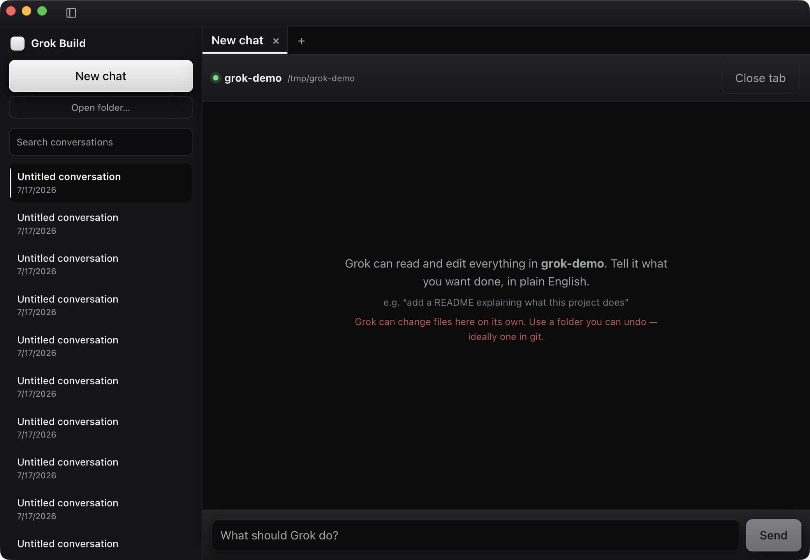
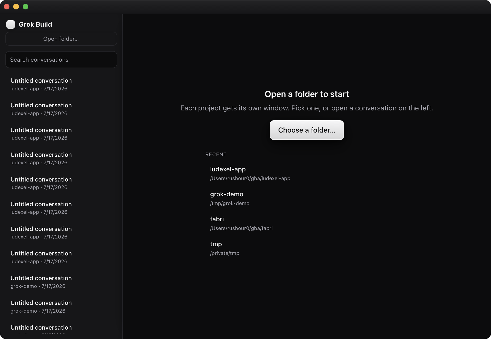

<h1 align="center">Grok Build Desktop</h1>

<p align="center"><strong>Grok's coding agent — xAI's open-source <a href="https://github.com/xai-org/grok-build">Grok Build</a> — without the terminal.</strong></p>

<p align="center">
  <a href="https://grok.rushour0.com"></a>
</p>

<p align="center">
  <a href="https://grok.rushour0.com"><strong>grok.rushour0.com</strong></a>
  &nbsp;·&nbsp;
  <a href="https://github.com/Rushour0/grok-build-desktop/releases/latest">All installers — macOS · Windows · Linux</a>
  &nbsp;·&nbsp;
  <a href="#run-it-from-source">Build from source</a>
</p>

<p align="center">
  
</p>

xAI open-sourced Grok Build, their coding agent. It's genuinely good. It's also a
terminal app, which means most people can't use it.

This is a small desktop app that fixes that. Download it, click **Install Grok Build**,
click **Sign in**, pick a folder, and type what you want in plain English. No terminal,
no `npm install`, no API keys to hunt down, no config files.

**macOS** builds are signed and notarized as of v0.8.2 — drag to Applications and
double-click. No `xattr`, no right-click trick. (Releases before v0.8.2 were unsigned and
will still fail with *"Grok Build Desktop is damaged and can't be opened"* — download the
latest instead.)

**Windows** builds are still unsigned, so SmartScreen warns on first open: click
**More info → Run anyway**. See [SIGNING.md](SIGNING.md).

> **Status: early.** The app installs the CLI, signs you in, opens a folder, and streams
> real answers and live tool activity back. See [Known limits](#known-limits) before you
> point it at anything precious.

## What it does

- **Installs the agent for you.** If `grok` isn't on your machine, one button fetches it
  from xAI's official installer. You never open a terminal.
- **Signs you in.** One "Sign in with Grok" button, browser handles the rest.
- **Works on a folder you pick.** Native folder picker instead of `cd`.
- **Shows the work.** Streamed answers, live tool cards as the agent reads and edits files,
  a running plan, and per-turn token usage — all in a monochrome UI with subtle depth and
  motion that stays out of the way.
- **Reviews every edit before it lands.** Each change grok proposes opens as a side-by-side
  **split-view diff** — matching lines aligned across from each other, changed words
  highlighted, long unchanged stretches collapsed — behind an Allow/Deny gate. No approving
  edits blind from a terminal scrollback.

<p align="center">
  
</p>
<p align="center"><em>The launcher: pick a folder or reopen a recent project; every window is one project.</em></p>

## How it works

Grok Build ships an [Agent Client Protocol](https://agentclientprotocol.com) interface
(`grok agent stdio`) — JSON-RPC 2.0 over stdio. This app is a [Tauri](https://tauri.app)
shell whose Rust host spawns that process and bridges it to a small React UI:

```
webview (React)  --invoke-->  Rust host  --stdin-->   grok agent stdio
webview (React)  <--emit----  Rust host  <--stdout--  grok agent stdio
```

No local web server, no ports, no Electron. The whole bridge is one file:
[`src-tauri/src/lib.rs`](src-tauri/src/lib.rs).

## Run it from source

You need [Rust](https://rustup.rs) and [Node](https://nodejs.org). You do **not** need to
install Grok Build first — the app does that.

```bash
git clone https://github.com/Rushour0/grok-build-desktop
cd grok-build-desktop
npm install
npm run tauri dev
```

## Known limits

**Grok's ACP approval path does not fire.** Verified against grok 0.2.101:
`grok agent stdio` never emits `session/request_permission`, with or without
`[features] support_permission = true`. This was not a configuration mistake.

v0.2.0 adds a real approval gate through Grok's `PreToolUse` hook system. The app
installs a global, default-deny hook that asks you to **Allow** or **Deny** each file
edit or shell command before it runs. Only local read-only tools (reading files,
searching, listing) pass automatically; anything that writes, runs a command, or reaches
the network prompts you first.
It is default-deny on purpose: Grok will try alternate tools when one is blocked (it
will reach for a shell or a background-task tool if a file-edit tool is denied), so an
allowlist of safe tools holds where a denylist of dangerous ones does not.

This is meaningful risk reduction, not a hard security boundary. The hook system fails
open: if the approval process times out or crashes, Grok proceeds. Approval is available
on **macOS and Linux**. Windows approval now exists, but is **experimental and not yet
verified on real Windows** because the maintainer develops on macOS. It fails open like
the other platforms, so if the hook does not fire you simply get the previous no-approval
behavior — it cannot make Windows less safe. Windows users: please report whether the
Allow/Deny prompt appears. **Use this on a folder under version control**, so you can
always `git diff` and undo.

As of v0.9.3, Preferences has a read-only **Tools & Safety** panel that shows the exact list of
local read-only tools the app auto-approves. It's transparency only — the panel does not change
what gets approved, and it never will be driven by anything Grok reports about itself (see
below).

## Watching for upstream drift

v0.9.3 adds a scheduled CI job (`scripts/track-upstream.sh`, `.github/workflows/track-upstream.yml`)
that checks xAI's `grok` npm package version, the ACP schema version, and Grok's own tool-metadata
schema and default models against snapshots committed in `compat/`. If any of them drift, it opens
a single PR classifying the change (`security` / `protocol` / `feature`) for a human to review — it
never edits `src/` or `src-tauri/` itself, and it never touches the approval allowlist.

**This does not change how anything gets approved.** The app's default-deny allowlist
(`READONLY_TOOLS` in `src-tauri/src/lib.rs`) is unchanged in v0.9.3 and remains the sole authority
over what runs automatically. Grok-reported tool metadata (`x.ai/tool`, including any `read_only`
flag) is display-only everywhere in this app — it is never consulted to decide whether something
auto-approves. The watcher-bot exists so a human notices upstream drift quickly; it does not grant
Grok, or its own metadata, any new trust.

## Roadmap

- [x] Auto-install the Grok Build CLI from inside the app
- [x] Browser sign-in (ACP `authenticate`)
- [x] Folder picker → session → streamed answers + live tool cards
- [x] Recent projects, read from the CLI's own session store
- [x] Installers built by CI for macOS / Windows / Linux
- [x] **Approval before edits** — via a `PreToolUse` hook bridged back to the app
  (default-deny hook; macOS/Linux, experimental on Windows; best-effort, fails open)
- [x] Plan timeline — the agent's plan streams into the transcript as it works
- [x] Run history in a persistent sidebar, with search across past sessions
- [x] File drop into prompts — drag files onto the composer to attach them
- [x] Tabbed parallel runs
- [x] System tray
- [x] Per-turn and cumulative token usage
- [x] Approval on Windows (experimental, unverified)
- [x] Code-signed + notarized macOS builds (no Gatekeeper warning) — v0.8.2
- [x] Expandable tool cards driven by x.ai/tool metadata, plus syntax-highlighted code
  blocks with copy — v0.9.0
- [x] Command palette (Cmd/Ctrl+K), slash-command palette from available_commands_update, and
  @-mention file autocomplete — v0.9.1
- [x] Preferences (Cmd/Ctrl+,), Light/Dark/System theme toggle, and a model + reasoning-effort
  panel — v0.9.2
- [x] An upstream watcher-bot that opens a PR when Grok/ACP tool schema, models, or versions
  drift, plus a read-only Tools & Safety panel in Preferences — v0.9.3
- [x] Message actions — copy any message, and edit-and-resend a prompt as a new turn — v0.9.4
- [x] Checkpoint/rewind — restore an earlier point in a conversation (conversation, files, or
  both), from a "Rewind to here" action on your own messages, with a two-step confirmation
  before any file restore — v0.9.5

Not yet, on the list:

- [ ] Cost display — token counts are shown, but not converted to currency
- [ ] Code-signed Windows builds (no SmartScreen warning)
- [ ] Optional `XAI_API_KEY` sign-in for people using API credits

## Credits

This is an independent open-source wrapper. It is not affiliated with or endorsed by xAI.
All the actual intelligence is [xai-org/grok-build](https://github.com/xai-org/grok-build),
used under Apache-2.0. See [NOTICE](NOTICE).

Licensed under [Apache-2.0](LICENSE).
